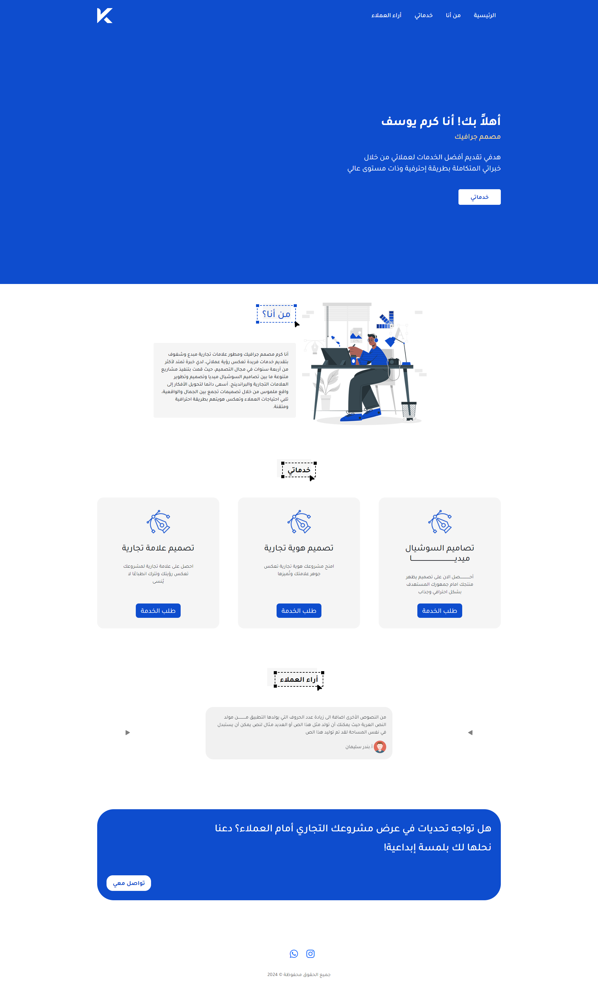

# Porject: Karam's Portfolio

This is a modern and responsive portfolio website created for a client to showcase their work, skills, and achievements. The website features a clean and user-friendly design, built using HTML, CSS, and Bootstrap. 

It includes sections such as About Me, Portfolio, Services, Testimonials, and Contact. The goal of this project is to provide an online presence that highlights the client's expertise and helps them connect with potential customers or employers.

## Live Demo:
- [https://zaki-abed.github.io/karam-portfolio/](https://zaki-abed.github.io/karam-portfolio/)

## Screenshots
**Index Page**

